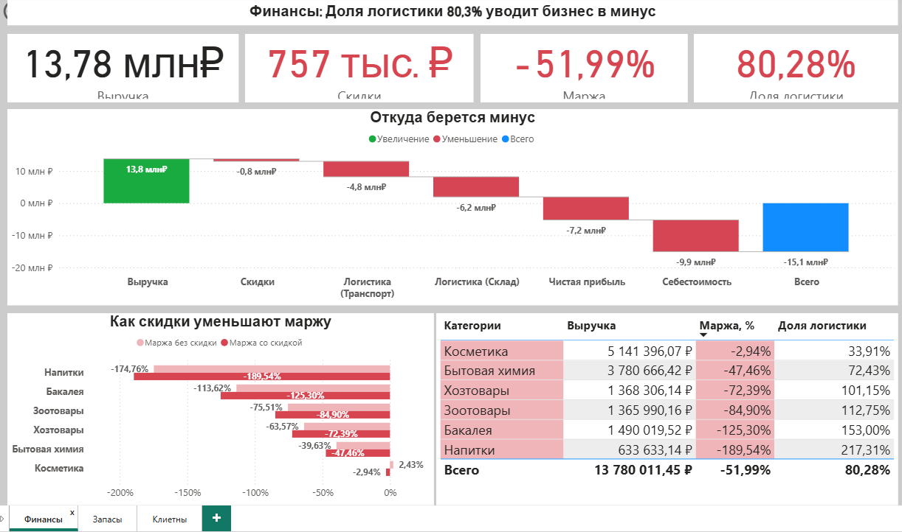
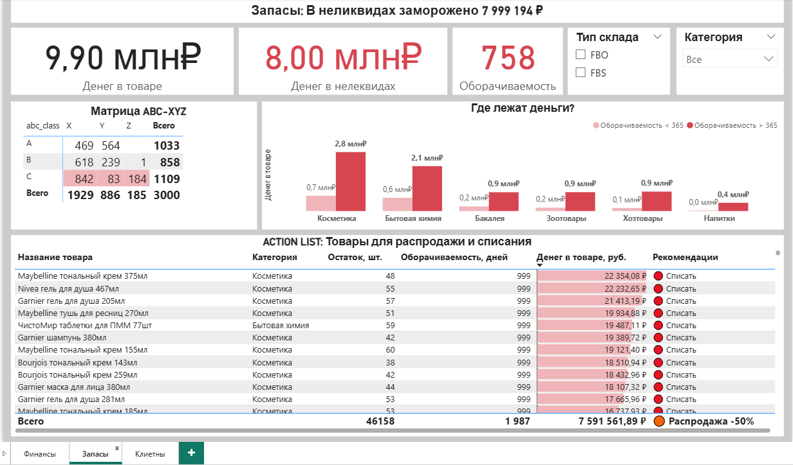
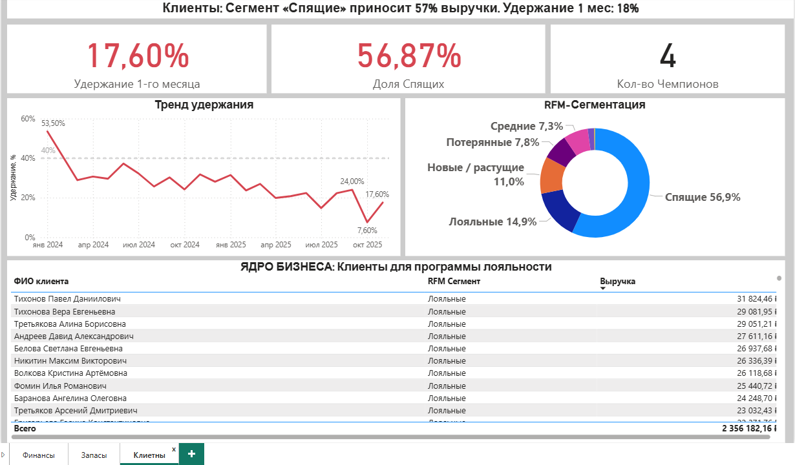

## Антикризисный аналитический дашборд (E-commerce)

**Задача**: Проанализировать убыточный интернет-магазин (маржа -56%) и найти точки кратного роста прибыли.  
**Инструменты**: Python (Pandas, RFM/ABC-анализ), Power BI (DAX, Power Query).

**Главные инсайты**:
 - Логистика FBO съедает 79% выручки из-за перетарки склада в 18 раз выше нормы.
 - 60% ассортимента — неликвиды (8 млн ₽ заморожено).
 - Удержание клиентов упало с 54% до 8%, но 57% выручки приносят "Спящие" клиенты. Совокупный потенциал: +12-14 млн ₽ за 2 года.
---
### Страница 1: Финансы (Поиск дыр)

Визуал "**Водопад**" наглядно показывает, как именно себестоимость и логистика FBO съедают выручку.  
Столбчатая диаграмма показывает, что хаотичные скидки в условиях убытка лишь усиливают яму.

---
### Страница 2: Запасы (Разморозка капитала)

Динамическая ABC-матрица (DAX-мера m_Matrix_Alert) автоматически красит проблемную зону класса "C".  
Таблица "Action List" с фильтром Turnover_Days >= 365 — готовый инструмент для принятия решений коммерческим отделом (экспорт в csv одним кликом).

---
### Страница 3: Клиенты (Макро-диагноз и реактивация)

Линейный график тренда мгновенно показывает обвал удержания с 54% до 8%.  
Кольцевая диаграмма RFM фокусирует взгляд на доминирующем сегменте «Спящие».  
Таблица внизу — готовый список ядра для программы лояльности.

---
**Динамические заголовки страниц** пересчитываются через DAX-формулы (например: "Финансы: Доля логистики " & FORMAT([m_Logistics_Share_%], "0.0%")).
